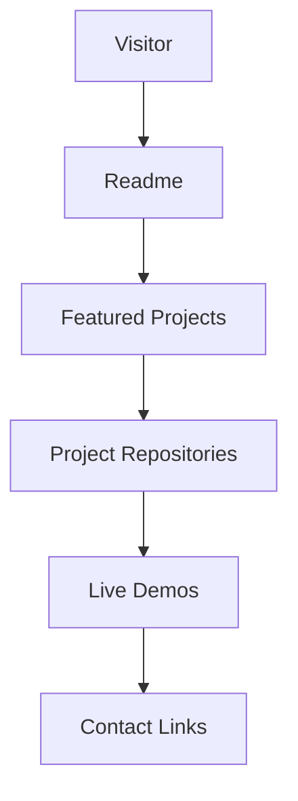

# Yashwanth Kumar Kotla

**MS Data Science @ Webster University, Austin TX** · Graduating Dec 2026 · Open to Data Scientist & MLOps roles 

[](https://linkedin.com/in/kotlayashwanthkumar)
[](mailto:kotla.yashwanthkumar@gmail.com)

---

## Featured Projects

| Project | What it does | Stack | Live |
|---|---|---|---|
| 📈 [FilingPulse](https://github.com/Yashwanth-Kumar-Kotla/FilingPulse) | RAG and Sentiment Analysis on SEC filings for top 49 companies | Langchain · RAG · Sentiment-Analysis | [▶ Demo](https://filingpilse-app.onrender.com/)  |
| 📡 [Layoff Radar](https://github.com/Yashwanth-Kumar-Kotla/layoff-radar) | Predicts tech company layoff risk using financial signals + SHAP explainability | XGBoost · FastAPI · Streamlit · Docker | [▶ Demo](https://layoff-streamlit.onrender.com) |
| 🧠 [Aura Dual Intelligence](https://github.com/Yashwanth-Kumar-Kotla/aura-dual-intelligence) | GPT-4 + Gemini collaboration engine for higher accuracy reasoning | GPT-4 · Gemini · JavaScript | [▶ Demo](https://www.auraduo.app/) |
| 🏥 [Insurance Category Predictor](https://github.com/Yashwanth-Kumar-Kotla/Insurance_Premium_category_predictor) | Predicts medical insurance charges — R² 0.77 | Scikit-learn · FastAPI · Streamlit · Docker | [▶ Demo](https://insurance-cat.streamlit.app/) |

---

## Skills

```python
languages  = ["Python", "SQL", "Java"]
ml         = ["XGBoost", "Scikit-learn", "SHAP", "SMOTE", "MLflow"]
mlops      = ["FastAPI", "Docker", "GitHub Actions", "Render"]
data       = ["Pandas", "NumPy", "SimFin API", "Feature Engineering"]
viz        = ["Streamlit", "Plotly", "Tableau", "Power BI", "Seaborn"]
llm        = ["Langchain", "RAG", "Agents", "Tools", "Loops"]
```

---

## How to explore

- Click any project name to view the repository.
- Click the Demo links to open live demos where available.
- Use the LinkedIn or Email badges above to contact me.

---

## Architecture diagram



---